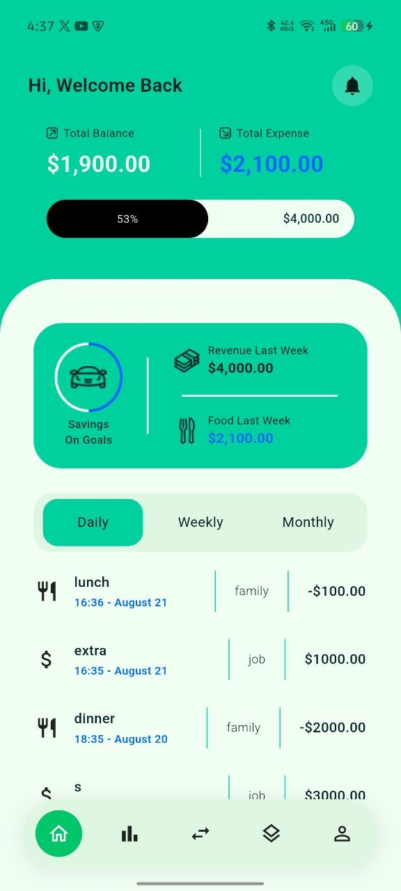
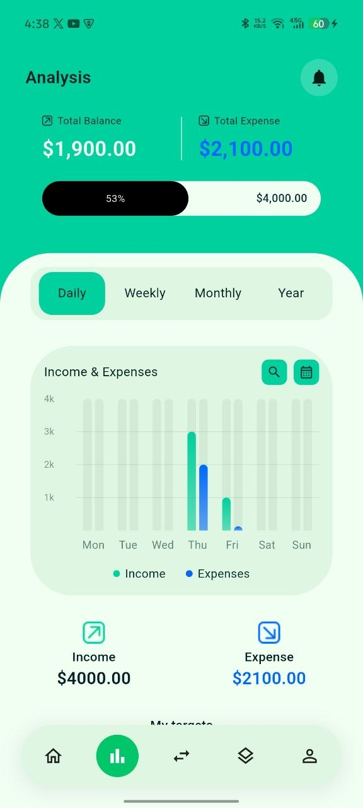
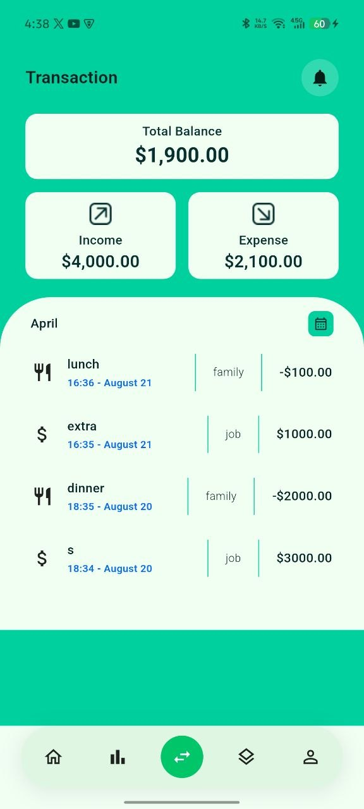
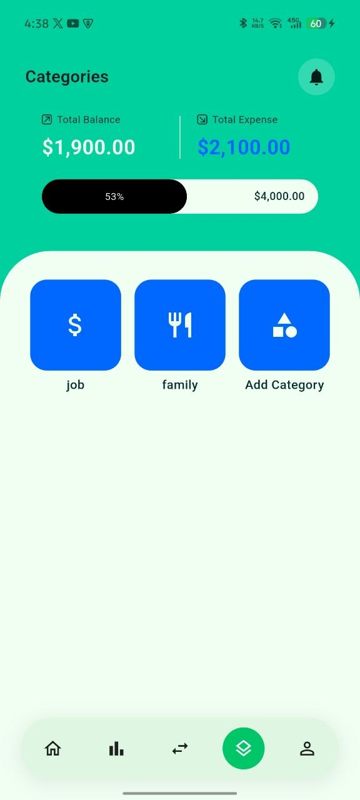
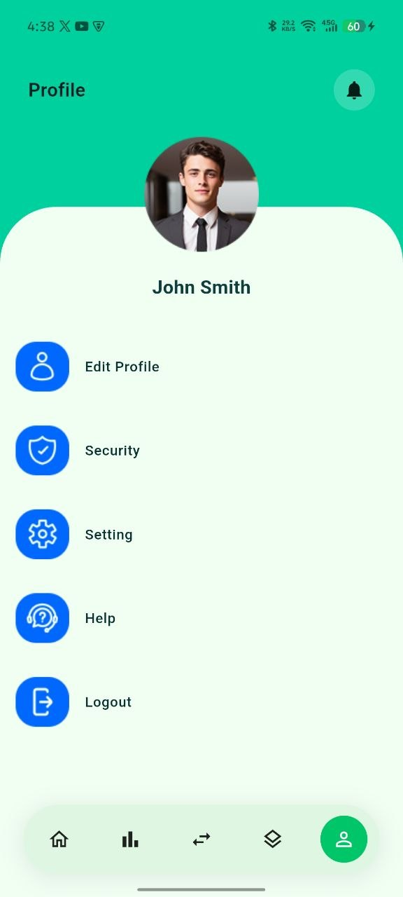

# 💰 Finance Tracker

A clean, modern personal finance and expense tracking app built with Flutter. Track your income and expenses, visualize spending trends, organize transactions by category, and set savings targets — all in one place.

---

## 📱 Screens

<table>
  <tr>
    <td align="center"><b>Home</b></td>
    <td align="center"><b>Analysis</b></td>
    <td align="center"><b>Transactions</b></td>
  </tr>
  <tr>
    <td></td>
    <td></td>
    <td></td>
  </tr>
  <tr>
    <td align="center"><b>Categories</b></td>
    <td align="center"><b>Add Category</b></td>
    <td align="center"><b>Profile</b></td>
  </tr>
  <tr>
    <td></td>
    <td></td>
    <td></td>
  </tr>
</table>

---

## ✨ Features

- **Home Dashboard** — at-a-glance total balance, income vs. expense breakdown, expense-to-income ratio indicator, and recent transactions filtered by Daily / Weekly / Monthly.
- **Analysis** — visual income vs. expense bar chart across Daily / Weekly / Monthly / Yearly periods, with savings target progress tracking.
- **Transactions** — full transaction history with category icons, timestamps, and amounts.
- **Categories** — browse and manage spending categories, each with a custom icon and type (income/expense).
- **Add Category** — create custom categories tailored to your spending habits.
- **Profile** — manage account and app preferences.

---

## 🛠️ Tech Stack

| Layer            | Tool                                                              |
| ---------------- | ----------------------------------------------------------------- |
| Framework        | [Flutter](https://flutter.dev)                                    |
| State Management | [flutter_bloc](https://pub.dev/packages/flutter_bloc) (Cubit)     |
| Local Database   | [Isar](https://isar.dev)                                          |
| Charts           | [fl_chart](https://pub.dev/packages/fl_chart)                     |
| Responsive UI    | [flutter_screenutil](https://pub.dev/packages/flutter_screenutil) |
| Formatting       | [intl](https://pub.dev/packages/intl)                             |
| Spacing Utility  | [gap](https://pub.dev/packages/gap)                               |

---

## 🏗️ Architecture

The app follows a **feature-first** structure, with each feature organized into its own `data`, `cubit`/`bloc`, and `widgets` layers:

```
lib/
├── core/
│   ├── utils/            # AppColors, AppStyles, constants
│   └── helpers/          # IconMapper, formatters
├── shared/
│   ├── widgets/          # CustomText, CustomAppBar, reusable UI
│   └── summary/          # Shared SummaryCubit (balance, income, expense)
└── features/
    ├── home/
    ├── analysis/
    ├── transactions/
    ├── categories/
    └── profile/
```

Each feature's Cubit exposes a sealed `State` (`Initial`, `Loading`, `Success`, `Failure`/`Error`) consumed via `BlocBuilder`, with repositories abstracting Isar queries from the UI layer.

---

## 📂 Project Structure Highlights

- **`SummaryCubit`** — shared across Home and Analysis screens, streams live income/expense totals from the transactions database.
- **`AnalysisCubit`** — fetches bucketed income/expense data (daily/weekly/monthly/yearly) for the chart.
- **`TransactionRepo` / `SummaryRepo`** — Isar-backed repositories that join transactions with their categories.
